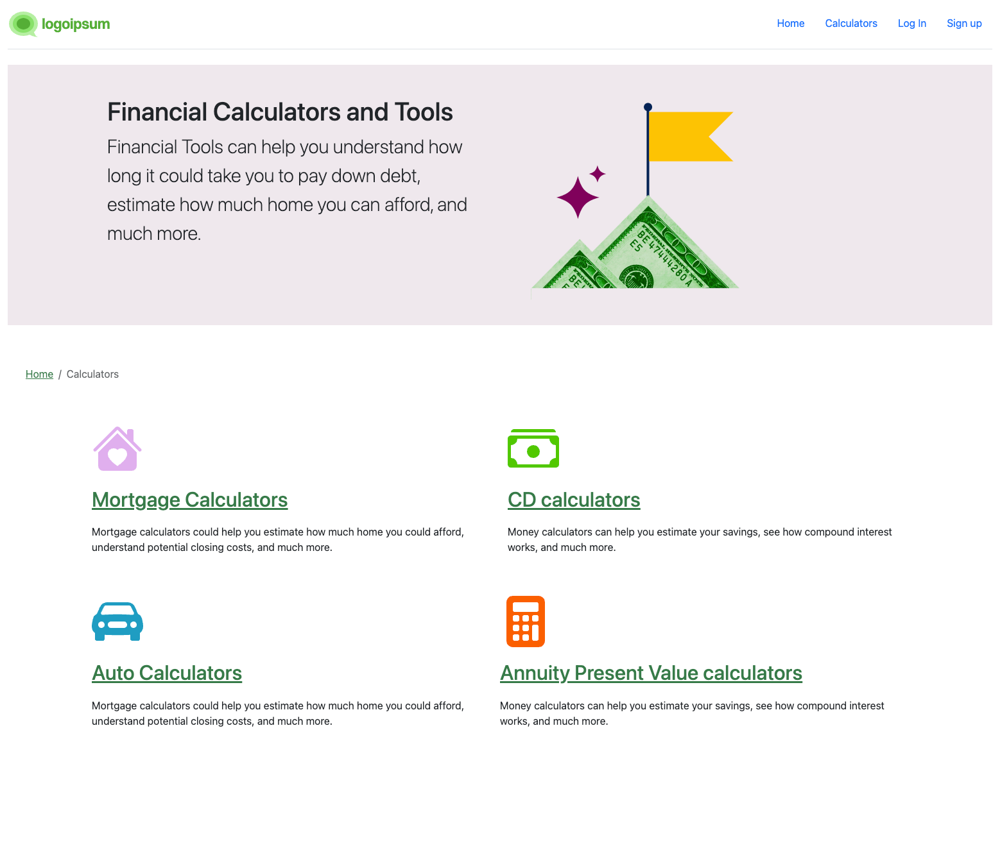
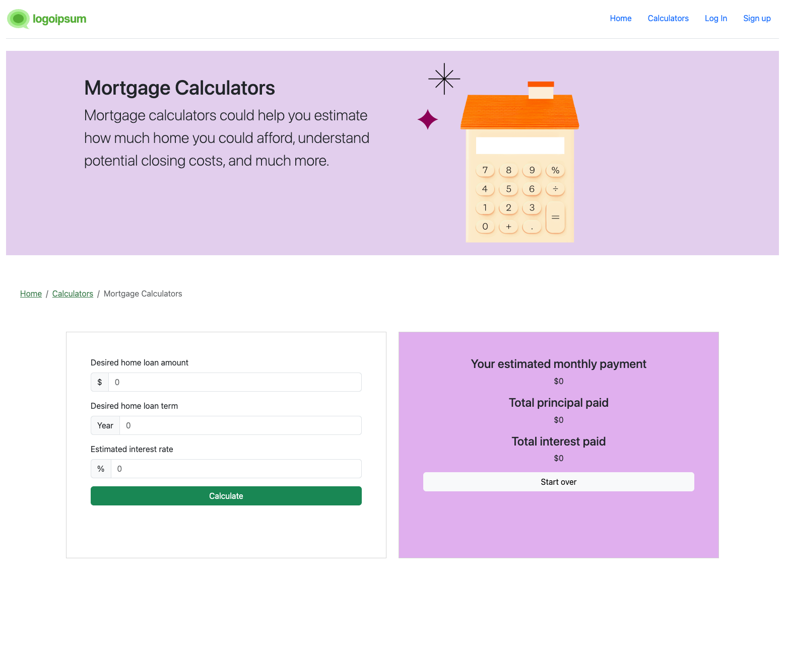
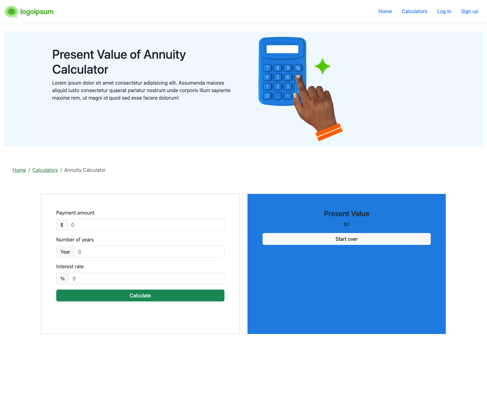

# Workshops - 1 Financial Calculators

### Design insipired by creditkarma.com

### Calculators Page

#### Morgage Calculator Page
A mortgage calculator - it is used to calculate out how much a monthly payment for a loan would be (minus any insurance or taxes), as well as how much interest you would pay over the
life of the loan.

a. It would accept the principal, interest rate, and loan length from the user

b. It would display the expected monthly payment and total interest paid

#### CD Calculator Page
A calculator that determines the future value of a one-time deposit assuming compound interest - it is used to help you decide how much a CD will be worth when it matures.

a. It would accept the deposit, interest rate, and number of years from the user.

b. It would display the future value and the total interest earned.

#### Annuity Calculator Page

A calculator that determines the present value of an ordinary annuity.

a. It would accept the monthly payout, expected interest rate, and years to pay out from the user.

b. It would display the present value of that annuity.

